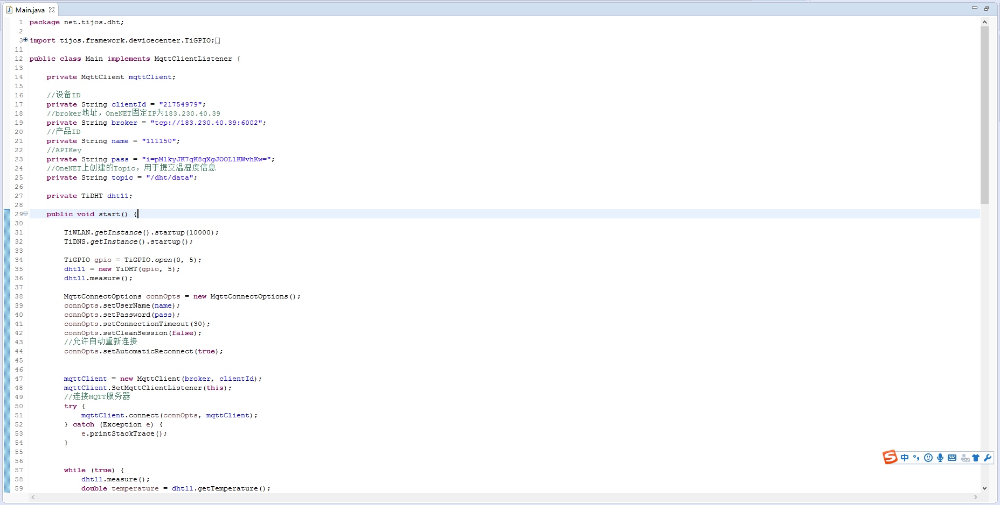
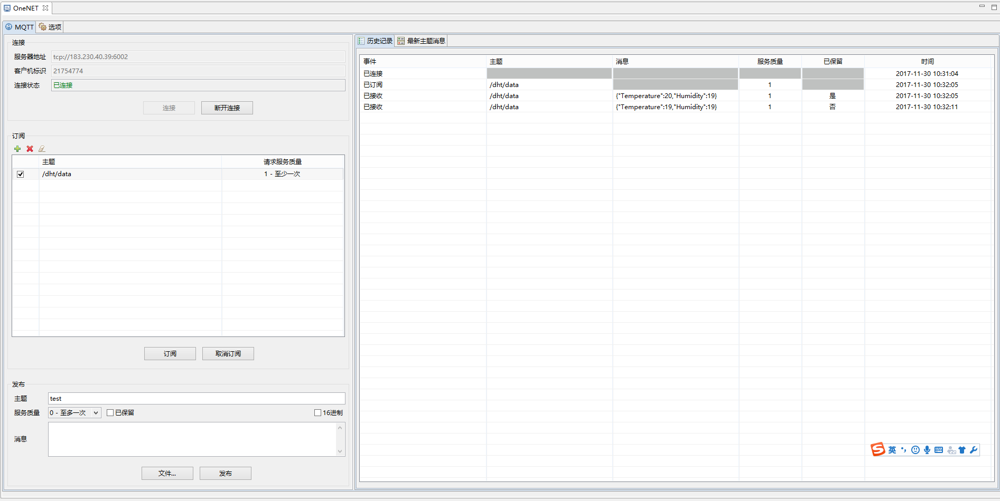
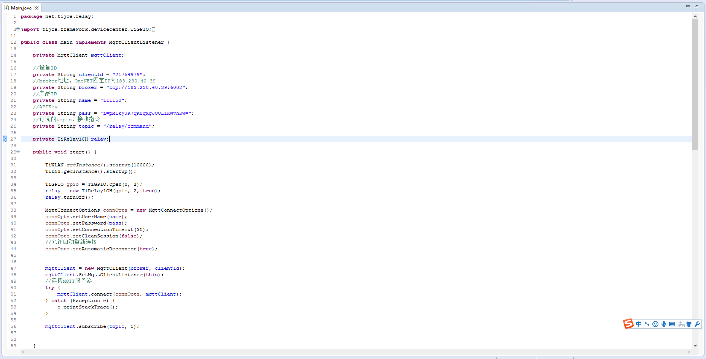
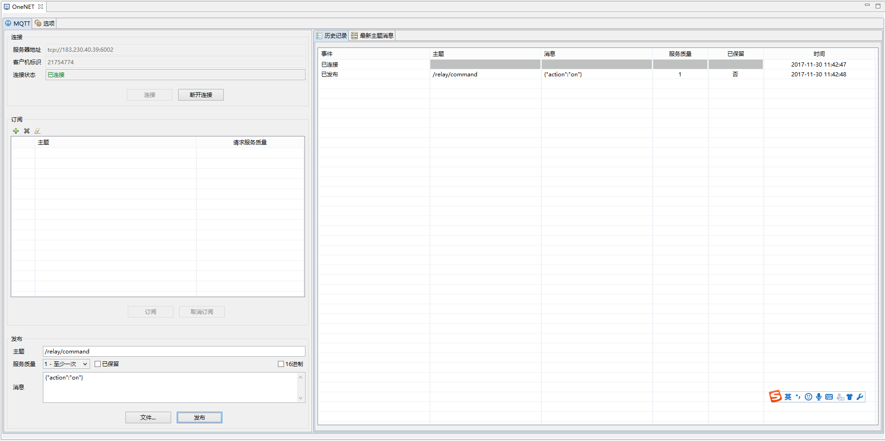
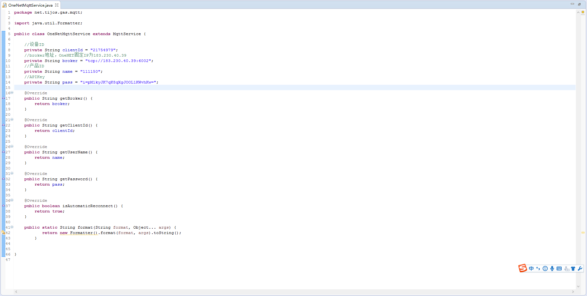
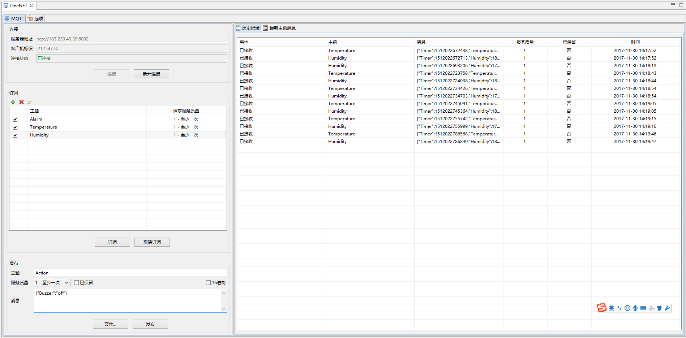

# 基于钛极OS(TiJOS)的OneNET接入案例

## 简介

中移物联网开放平台针对物联网环境提供多种协议支持，而MQTT协议以其独特的优势在设备端得到广泛支持。本文将介绍基于ESP8266的TiJOS系统以MQTT协议接入OneNET的相关操作。关于OneNET中MQTT支持请查阅<https://open.iot.10086.cn/doc/art253.html#68>文档。

应用源码

| 应用                                       | 说明                 |
| ---------------------------------------- | ------------------ |
| [NetworkDHT](./TiJOSApp/NetworkDHT)      | 基于MQTT协议的网络温湿度采集应用 |
| [NetworkRelay](./TiJOSApp/NetworkRelay)  | 基于MQTT协议的网络继电器控制应用 |
| [OneNetApplication](./TiJOSApp/OneNetApplication) | 基于MQTT协议的可燃气体检测仪应用 |

## 创建产品

首先在OneNET中创建产品，可通过开发者中心和Restful API两种方式进行创建，我们这里通过开发者中心创建，创建步骤参考<https://open.iot.10086.cn/doc/art243.html#66>即可，产品名称可以自定义，操作系统选择其他，设备接入方式选择公开协议，设备接入协议选择MQTT。创建成功后可以得到产品ID、APIKey等信息，接着在产品下添加设备，添加步骤参考<https://open.iot.10086.cn/doc/art83.html#29>即可，设备名称输入设备的编号别名，鉴权信息可以自定义，数据保密性选择私有即可。点击接入设备后OneNET会生成设备ID、API地址等信息。

## 设备接入

本文附带三个工程，分别为NetworkDHT、NetworkRelay、OneNetApplication，前面我们已经成功在OneNET创建产品并添加了设备，后面将针对这三个工程进行修改编译。关于ESP8266外设连接请参考<https://github.com/TiJOSteam/tijos-hardware-example/tree/master/src/Integrations/GasMonitoringSample>，连接无误后即可进行TiJOS应用开发。

NetworkDHT：实时采集温湿度信息，并通过MQTT上传至OneNET，客户端通过订阅Topic的方式获取。

首先将工程导入Ti-Dev Studio，然后打开类net.tijos.dht.Main，代码里包含DHT采集以及MQTT通讯的代码。在代码17至25行为MQTT的配置参数，修改为OneNET上创建应用时生成的对应数据。在58至70行为DHT温湿度采集并通过MQTT实时上传代码，上传payload内容为json格式，无需修改。

将代码中的MQTT参数修改后，在Ti-Dev Studio中选择工程右键“Run as -> TiJOS Application ”运行至设备中。关于Ti-Dev Studio环境安装请参考<http://dev.tijos.net/docstore/tijos_docs_devguide>。

运行成功后使用Eclipse Paho MQTT Utility工具连接OneNET并订阅topic：/dht/data来模拟客户端接收设备。

NetworkRelay：网络继电器开关，通过MQTT接收指令对继电器进行控制。

同样将工程导入Ti-Dev Studio，然后打开类net.tijos.relay.Main，在代码17至25行为MQTT的配置参数，修改为OneNET上创建应用时生成的对应数据。第48行代码向MQTT注册事件监听，第56行代码进行topic订阅，在76至84行为继电器控制代码。代码中MQTT参数修改完毕后选择工程右键“Run as -> TiJOS Application ”运行至设备中。

运行成功后使用Eclipse Paho MQTT Utility工具连接OneNET，在Paho中直接发布payload消息{"action":"off"}或{"action":"on"}至topic：/relay/command对继电器进行开关控制。

OneNetApplication：可燃气体监测仪。这是一套安防行业的火灾预警模块，用于监测周边可燃气体浓度和火灾报警。关于可燃气体监测仪的介绍请参考<https://github.com/TiJOSteam/tijos-hardware-example/tree/master/src/Integrations/GasMonitoringSample>。

将工程导入Ti-Dev Studio，可看到工程中的代码量明显比前面两个工程多很多，打开类net.tijos.gas.mqtt.OneNetMqttService，代码8至14行为MQTT的配置参数，修改为OneNET上创建应用时生成的对应数据，然后选择工程右键“Run as -> TiJOS Application ”运行至设备中。

接着打开Eclipse Paho MQTT Utility工具连接至OneNET，在Paho中订阅Alarm、Temperature、Humidity三个topic用于接收监测仪的报警状态和环境温湿度。当监测仪发生报警时通过向topic：Action发送payload消息{"Buzzer":"off"}来关闭蜂鸣器。

至此三个工程分别实现了MQTT的接入、订阅和发布功能，以及基于TiJOS的多种传感器的操作。在实际开发中需要将TiJOS接入网络，可通过连接WIFI来实现，具体参考<http://dev.tijos.net/stepbystep/step2-device_manager/%E5%88%9D%E8%AF%86Ti-DeviceManager%E8%AE%BE%E5%A4%87%E7%AE%A1%E7%90%86%E5%99%A8/>。